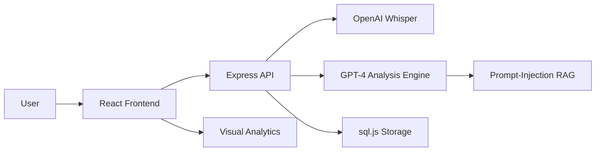

# ⚡ Salyzer — AI Sales Call Analyzer

Salyzer is an advanced, AI-powered platform designed to transform sales performance by providing actionable coaching insights from conversation recordings. By leveraging OpenAI's Whisper for transcription and GPT-4 for deep analysis, Salyzer identifies emotional shifts, detects missed opportunities, and compares agent responses against top-performing scripts.

---

## 🎨 Premium Aesthetics & Experience

Salyzer features a state-of-the-art **Dark Mode UI** built with **Tailwind CSS v4** and **Framer Motion**.
- **Dynamic Dashboards**: Real-time performance metrics and visual analytics.
- **Interactive Charts**: Emotional tone timelines and multi-dimensional scoring using **Recharts**.
- **Glassmorphism**: A modern, vibrant interface with subtle micro-animations for a premium feel.

---

## 🚀 Key Functionalities

### 1. Audio Processing & Transcription
- **Seamless Upload**: Drag-and-drop interface for MP3, WAV, and WebM files.
- **Whisper AI Integration**: High-accuracy automated transcription of sales conversations.
- **Secure Handling**: Files are processed and temporary data is purged post-analysis.

### 2. Intelligent Conversation Analysis
- **Stage Detection**: Automatically identifies Opening, Discovery, Pitch, Objection Handling, and Closing phases.
- **Emotional Tone Timeline**: Visualizes agent confidence and customer sentiment shifts throughout the call.
- **Missed Opportunity Detection**: Flags unanswered objections, ignored buying signals, and missed upsells.

### 3. RAG-Based Script Comparison
- **Performance Benchmarking**: Compares agent responses against a database of your organization's top-performing sales scripts.
- **Gap Analysis**: Identifies exactly where the agent deviated from best practices and suggests better phrasing.

### 4. Comprehensive Scoring & Feedback
- **Multi-Category Scoring**: Evaluates Clarity, Persuasion, Objection Handling, Closing, and Rapport.
- **AI-Powered Coaching**: Generates specific, actionable feedback with "Better Phrasing" examples.

### 5. Managerial Oversight
- **Team Performance View**: Dedicated dashboard for managers to monitor agent metrics, call volumes, and average scores.
- **Coaching Tools**: Access to the full history of agent analyses to streamline performance reviews.

---

## 🏗️ Technical Architecture



### Backend Implementation
- **Node.js & Express**: High-performance API handling.
- **sql.js (SQLite)**: Pure JavaScript implementation of SQLite for high portability and Windows-native compatibility.
- **JWT Authentication**: Secure, stateless user sessions with role-based access control (Agent vs. Manager).
- **Service-Oriented Logic**: Modular AI services for transcription and analysis pipelines.

### Frontend Implementation
- **Vite & React 19**: Ultra-fast development and optimized production builds.
- **Tailwind CSS v4**: Utility-first styling with custom dark-palette tokens.
- **Context API & Axios**: Robust state management for auth and centralized API communication.

---

## 📂 Project Structure

```text
Salyzer/
├── client/                 # React Frontend
│   ├── src/
│   │   ├── components/     # Reusable UI (Sidebar, Layout)
│   │   ├── context/        # Auth & Global State
│   │   ├── pages/          # Dashboard, Upload, Analysis, Team
│   │   └── index.css       # Tailwind v4 & Design Tokens
│   └── vite.config.js      # Proxy & Plugin setup
└── server/                 # Express Backend
    ├── middleware/         # JWT Auth & Security
    ├── routes/             # Auth, Calls, Scripts, Team endpoints
    ├── services/           # OpenAI Logic & Demo Fallbacks
    ├── uploads/            # Temporary file storage
    ├── db.js               # sql.js Initialization & Helpers
    └── index.js            # Entry Point
```

---

## 🛠️ Setup & Installation

### Prerequisites
- [Node.js](https://nodejs.org/) (v18+)
- [OpenAI API Key](https://platform.openai.com/)

### 1. Server Configuration
```bash
cd server
npm install
```
Create a `.env` file in the `server` directory:
```env
OPENAI_API_KEY=your_api_key
JWT_SECRET=your_secret_key
PORT=3001
```

### 2. Client Configuration
```bash
cd client
npm install
```

### 3. Run the Application
In separate terminals:
```bash
# Start Backend
cd server
npm run dev

# Start Frontend
cd client
npm run dev
```

---

## 🔮 Future Enhancements
- [ ] **Live Coaching**: Real-time analysis of active calls via WebSocket.
- [ ] **CRM Integration**: Automatic logging of insights to HubSpot and Salesforce.
- [ ] **Voice Emotion Detection**: Frequency analysis for deeper emotional insight.
- [ ] **Multi-Language Support**: Analysis for international sales teams.

---

Developed with ❤️ as a premium AI Sales Solution.
